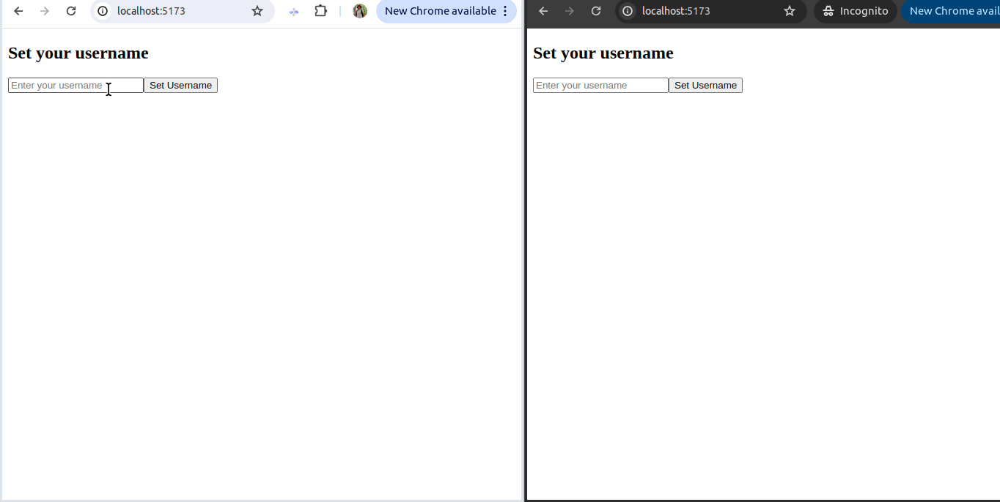

# Chat App

A simple chat application built with React JS and WebSocket.




### Setup and Running the Application

1. Clone the repository:
    ```bash
    git clone https://github.com/tegarsubkhan236/socket-simple-chat-app.git
    cd socket-simple-chat-app
    ```

2. Install server dependencies:
    ```bash
    cd server
    npm install
    npm run dev
    ```

3. Install client dependencies:
    ```bash
    cd ../client
    npm install
    npm run dev
    ```